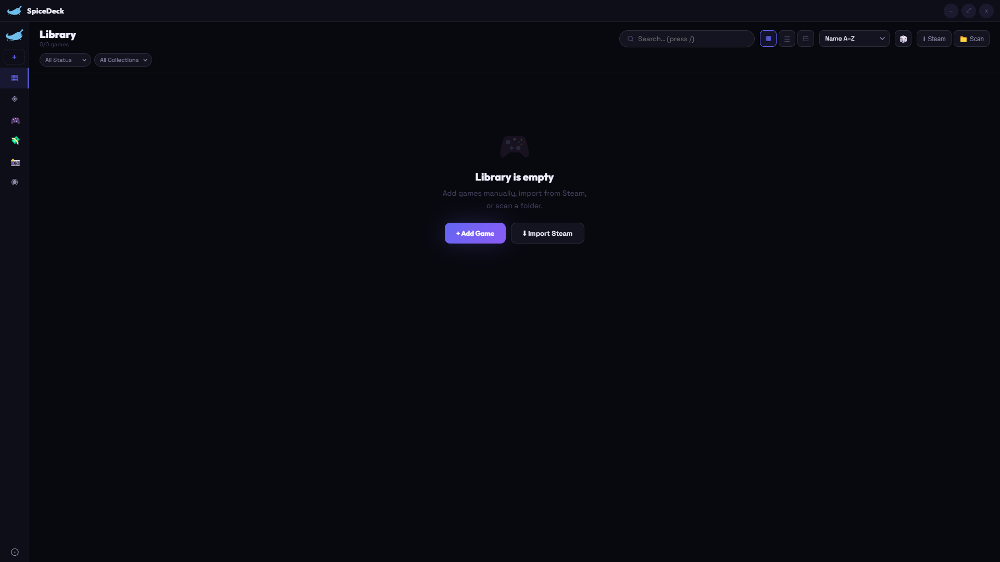
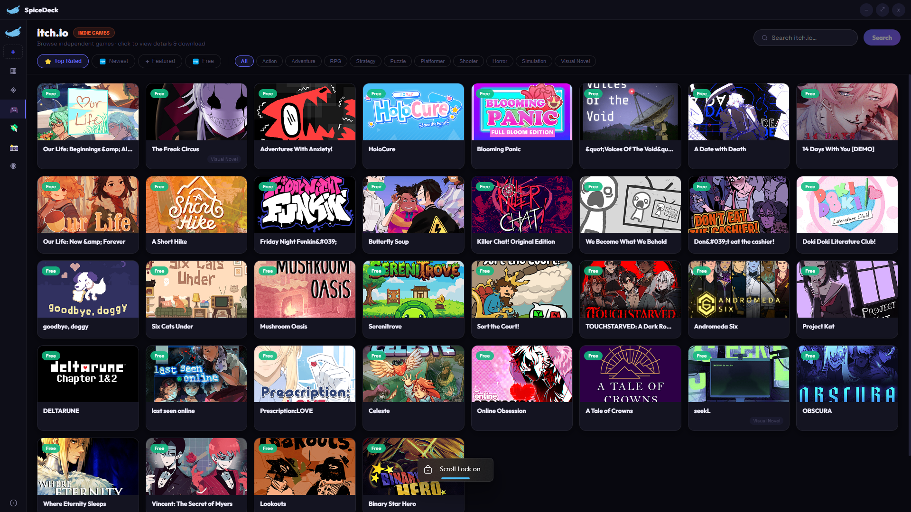

# SpiceDeck

### A modern, lightweight game launcher for Windows

Organize, track, and launch your entire game library — all in one place.

 

 

[⬇ Download](#-download) • [✨ Features](#-features) • [📸 Screenshots](#-screenshots) • [⚡ Why SpiceDeck](#-why-spicedeck) • [⚖ Legal](#-legal)

---

## ⬇ Download

| Platform | Installer |
|----------|----------|
| 🪟 Windows | [Download Latest](https://github.com/ash-kernel/spicedeck/releases/download/stable/SpiceDeck.Setup.exe) |

> 📦 You can also find all versions on the Releases page:
> https://github.com/ash-kernel/spicedeck/releases

> 🍎 macOS support planned (when I get access to a Mac 👀)

---

## ✨ Features

### 🎮 Game Library
- Add **any game** from your system (`.exe`)
- Clean, organized library view
- Add & launch games with one click

### 🧠 Smart Metadata
- Auto-fetch game information:
  - Cover art & screenshots
  - Game descriptions
  - Genres & tags
- Data from Steam, SteamSpy & OpenCritic
- **HowLongToBeat integration** — See how long games take to complete

### 📊 Game Insights
- **Track playtime** automatically
- View ratings & reviews:
  - Steam community scores
  - Metacritic ratings
  - OpenCritic scores

### 🔎 Discover & Explore
- Browse **50,000+ games**
- Search by title, genre, or tags
- Preview games before adding
- Watch trailers & view screenshots

### 📰 Game News & Updates
- Real-time gaming news from top gaming outlets
- PC Gamer, Rock Paper Shotgun, Eurogamer, IGN
- Stay updated on new releases & deals

### 🎨 Themes & Customization
- 8 beautiful themes:
  - Crimson, Dark, Neon, Ember
  - Rose, Ocean, Gold, Cyber
- Toggle tabs on/off for custom layouts
- Configure your perfect game launcher

### 💰 Smart Deals
- Browse game deals across multiple stores
- **Multi-currency support** — View prices in your local currency
- Filter by discount percentage and price range

### 🎮 GamePad Tester
- Built-in controller detection & testing
- Verify your gamepad works before launching games

### ⚡ System Integration
- Run on Windows startup *(optional)*
- **Auto-update checker** — Stay on the latest version
- Fully offline & local
- No accounts or login required

---

## ⚡ Why SpiceDeck?

Most launchers are either:
- ❌ bloated  
- ❌ tied to a platform  
- ❌ require accounts  

**SpiceDeck is different:**
- ✅ Works with *any game*  
- ✅ Fully offline & private  
- ✅ Lightweight and fast  
- ✅ No tracking, no nonsense  

---

## 📸 Screenshots

  

---

## 🔒 Privacy

SpiceDeck respects your privacy.

- No accounts  
- No analytics  
- No tracking  
- No cloud storage  

All data is stored **locally on your device**.

Game metadata is fetched directly from public APIs on your machine.

---

## 🛠 Tech Overview

- Desktop app (Windows)
- Local data storage
- External APIs:
  - Steam
  - SteamSpy
  - OpenCritic

---

## 🚀 Roadmap

- [ ] macOS support  
- [ ] Cloud sync  
- [ ] Advanced stats dashboard  
- [ ] Plugin system  

---

## ⚠️ Windows SmartScreen Warning

**Having trouble running the installer?**

On first launch, Windows may show a "SmartScreen Protection" or "Smart App Control" warning. This is normal for unsigned applications.

### How to Bypass SmartScreen

1. **When the warning appears:**
   - Click **"More info"** button
   - Click **"Run anyway"** at the bottom
   - The app will launch normally

2. **Or disable Smart App Control in Windows Defender:**
   - Open **Windows Security** (search in Start menu)
   - Go to **App & browser control**
   - Scroll down to **Smart App Control**
   - Change setting to **"Off"**
   - Restart your computer

### About Code Signing

The app isn't code-signed because code-signing certificates cost $50-$300+ per year. Since this is a personal project, I can't afford to pay for a certificate right now. Once you bypass the warning once, it won't bother you again!

---

## 🔄 Recent Updates (v4.0.0)

### ✨ New Features
- 📰 **Game News Tab** — Real-time gaming news from PC Gamer, Rock Paper Shotgun, Eurogamer & IGN
- 🎮 **GamePad Tester** — Built-in controller detection and testing
- 💱 **Multi-Currency Support** — View deals in your local currency
- 🎨 **4 New Themes** — Rose, Ocean, Gold, Cyber (8 total now)
- 📊 **Update Informer** — Auto-check for new versions
- 🔀 **Customizable Tabs** — Toggle sections on/off for your perfect layout
- 🕐 **HLTB Integration** — See completion times in game details

### 🐛 Fixes
- ✅ System tray icon now displays correctly
- ✅ Improved overall UI/UX

### Removed
- 🗑️ GOG support (focusing on Steam & itch.io)

---

## ⚖ Legal

- Privacy Policy: https://ash-kernel.github.io/spicedeck/#legal  
- Terms of Service: https://ash-kernel.github.io/spicedeck/#legal  

© SpiceDeck. All rights reserved.  
Redistribution or resale is not permitted.

---

Made with 💻 by  
https://github.com/ash-kernel

